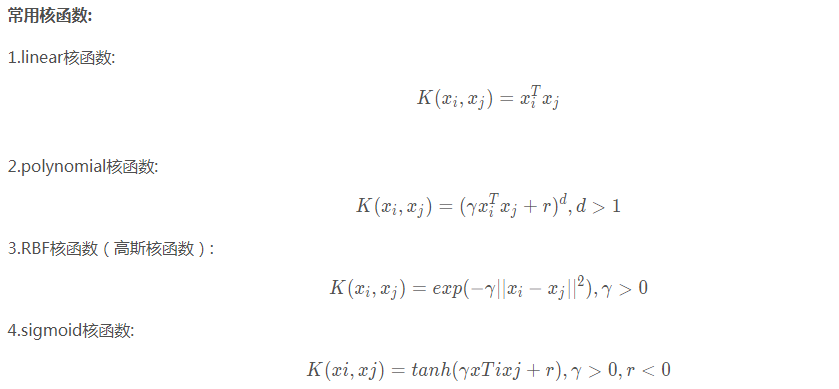

# 1. SVM的原理
SVM是一个二元分类算法，线性分类和非线性分类都支持。经过演进，现在也可以支持多元分类，同时经过扩展，也能应用于回归问题
# 2. SVM应用场景 
文本分类、图像识别、主要二分类领域
# 3. SVM优缺点 
SVM优点
- 1、解决小样本下机器学习问题。
- 2、解决非线性问题。
- 3、无局部极小值问题。（相对于神经网络等算法）
- 4、可以很好的处理高维数据集。
- 5、泛化能力比较强。

SVM缺点
- 1、对于核函数的高维映射解释力不强，尤其是径向基函数。
- 2、对缺失数据敏感
# 4. SVM sklearn 参数学习 

- 首先介绍下与核函数相对应的参数：
- 1）对于线性核函数，没有专门需要设置的参数
- 2）对于多项式核函数，有三个参数。-d用来设置多项式核函数的最高次项次数，也就是公式中的d，默认值是3。-g用来设置核函数中的gamma参数设置，也就是公式中的gamma，默认值是1/k（特征数）。-r用来设置核函数中的coef0，也就是公式中的第二个r，默认值是0。
- 3）对于RBF核函数，有一个参数。-g用来设置核函数中的gamma参数设置，也就是公式中gamma，默认值是1/k（k是特征数）。
- 4）对于sigmoid核函数，有两个参数。-g用来设置核函数中的gamma参数设置，也就是公式中gamma，默认值是1/k（k是特征数）。-r用来设置核函数中的coef0，也就是公式中的第二个r，默认值是0。

- 具体来说说**rbf核函数中C和gamma **：

- SVM模型有两个非常重要的参数C与gamma。其中 C是惩罚系数，即对误差的宽容度。c越高，说明越不能容忍出现误差,容易过拟合。C越小，容易欠拟合。C过大或过小，泛化能力变差
gamma是选择RBF函数作为kernel后，该函数自带的一个参数。隐含地决定了数据映射到新的特征空间后的分布，gamma越大，支持向量越少，gamma值越小，支持向量越多。支持向量的个数影响训练与预测的速度。
这里面大家需要注意的就是gamma的物理意义，大家提到很多的RBF的幅宽，它会影响每个支持向量对应的高斯的作用范围，从而影响泛化性能。我的理解：如果gamma设的太大，方差会很小，方差很小的高斯分布长得又高又瘦， 会造成只会作用于支持向量样本附近，对于未知样本分类效果很差，存在训练准确率可以很高，(如果让方差无穷小，则理论上，高斯核的SVM可以拟合任何非线性数据，但容易过拟合)而测试准确率不高的可能，就是通常说的过训练；而如果设的过小，则会造成平滑效应太大，无法在训练集上得到特别高的准确率，也会影响测试集的准确率。

# 5. 利用SVM模型结合 Tf-idf 算法进行文本分类
## 读取数据
```angular2
from sklearn.datasets import fetch_20newsgroups
import numpy as np
import pandas as pd

#初次使用这个数据集的时候，会在实例化的时候开始下载
data = fetch_20newsgroups()

categories = ["sci.space" #科学技术 - 太空
,"rec.sport.hockey" #运动 - 曲棍球
,"talk.politics.guns" #政治 - 枪支问题
,"talk.politics.mideast"] #政治 - 中东问题
train = fetch_20newsgroups(subset="train",categories = categories)
test = fetch_20newsgroups(subset="test",categories = categories)
```
## 使用TF-IDF将文本数据编码
```angular2
from sklearn.feature_extraction.text import TfidfVectorizer as TFIDF

Xtrain = train.data
Xtest = test.data
Ytrain = train.target
Ytest = test.target
tfidf = TFIDF().fit(Xtrain)
Xtrain_ = tfidf.transform(Xtrain)
Xtest_ = tfidf.transform(Xtest)
Xtrain_
tosee = pd.DataFrame(Xtrain_.toarray(),columns=tfidf.get_feature_names())
tosee.head()
tosee.shape

```
## SVM建模
```angular2
from sklearn.svm import SVC

clf = SVC()
clf.fit(Xtrain_,Ytrain)
y_pred = clf.predict(Xtest_)
proba = clf.predict_proba(Xtest_)
score = clf.score(Xtest_,Ytest)

print("\tAccuracy:{:.3f}".format(score))
print("\n")
```